# Mini Bookstore Management System

## Hướng dẫn setup (cách chạy + tạo database cho project)

### Bước 1: Chuẩn bị Cơ sở dữ liệu
1. Đăng nhập vào MySQL
2. Tạo database mới với tên: `php_bookstore_lab06_final`.
3. Thực thi nội dung từ file `Database/schema.sql` để thiết lập cấu trúc bảng.
4. Thực thi nội dung từ file `Database/seed.sql` để khởi tạo dữ liệu mẫu.

### Bước 2: Cấu hình kết nối
Tại file `Config/database.php`, cập nhật thông tin kết nối phù hợp với môi trường thực thi:
```php
return [
    'host' => 'localhost',
    'database' => 'php_bookstore_lab06_final',
    'username' => 'root',
    'password' => '', //Nếu MySQL có mật khẩu, hãy thay đổi giá trị `password` cho phù hợp.
    'charset' => 'utf8mb4',
];
```
### Bước 3: Chạy ứng dụng 
Mở Terminal tại thư mục gốc của dự án và chạy lệnh sau:
```bash
php -S localhost:8000 -t public
```
Sau đó, mở trình duyệt và truy cập :
```text
http://localhost:8000
```
## Danh sách Route chính

Hệ thống sử dụng cơ chế **Front Controller** tập trung tại `Public/index.php`. Dưới đây là các route chính:

### GET Routes (Hiển thị dữ liệu)
| Route | Controller@Action | Mô tả |
| :--- | :--- | :--- |
| `/` | `HomeController@index` | Trang chủ |
| `/login` | `AuthController@login` | Trang đăng nhập |
| `/dashboard` | `DashboardController@index` | Trang quản trị hệ thống |
| `/books` | `BookController@index` | Danh sách sách |
| `/books/create` | `BookController@create` | Form thêm sách |
| `/books/edit` | `BookController@edit` | Form sửa sách |
| `/orders` | `OrderController@index` | Danh sách đơn hàng |
| `/orders/create` | `OrderController@create` | Form tạo đơn hàng |
| `/orders/edit` | `OrderController@edit` | Form sửa đơn hàng |
| `/health` | `HealthController@index` | Kiểm tra trạng thái hệ thống |

### POST Routes (Xử lý dữ liệu)
| Route | Controller@Action | Mô tả |
| :--- | :--- | :--- |
| `/login` | `AuthController@handleLogin` | Xử lý đăng nhập |
| `/logout` | `AuthController@logout` | Đăng xuất |
| `/books/store` | `BookController@store` | Lưu sách mới |
| `/books/update` | `BookController@update` | Cập nhật sách |
| `/books/delete` | `BookController@delete` | Xóa sách |
| `/orders/store` | `OrderController@store` | Lưu đơn hàng mới |
| `/orders/update` | `OrderController@update` | Cập nhật đơn hàng |
| `/orders/delete` | `OrderController@delete` | Xóa đơn hàng |

## Tài khoản demo
| Vai trò | Email | Mật khẩu |
| :--- | :--- | :--- |
| Admin | admin@example.com | 123456 |
| Staff | sales@example.com | 123456 |

## Ảnh chụp màn hình
### Trang chủ
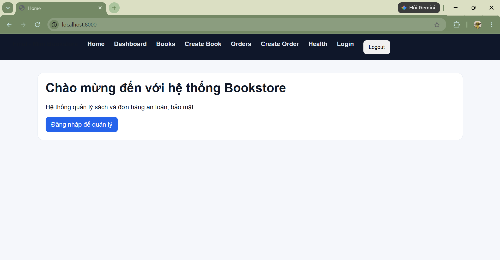

### Đăng nhập
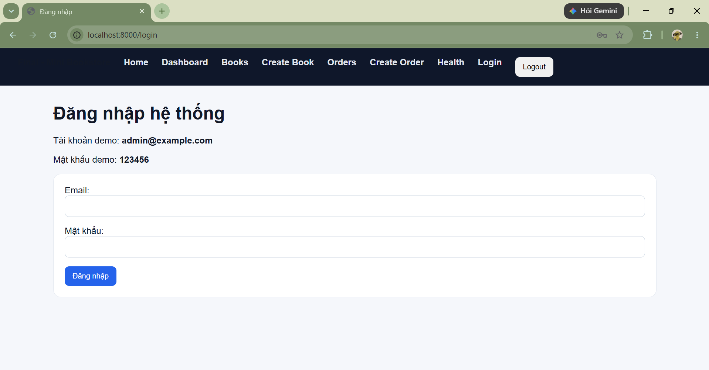

### Dashboard
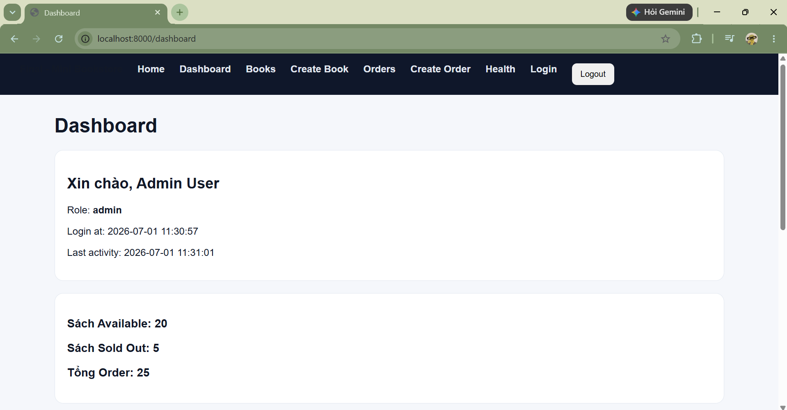
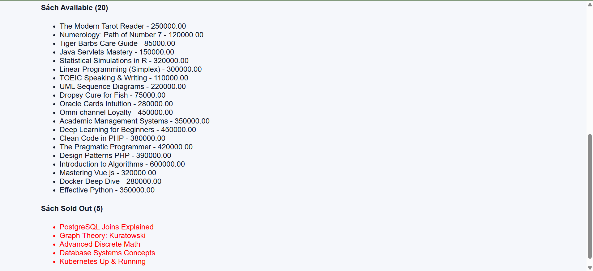

### Danh sách sách
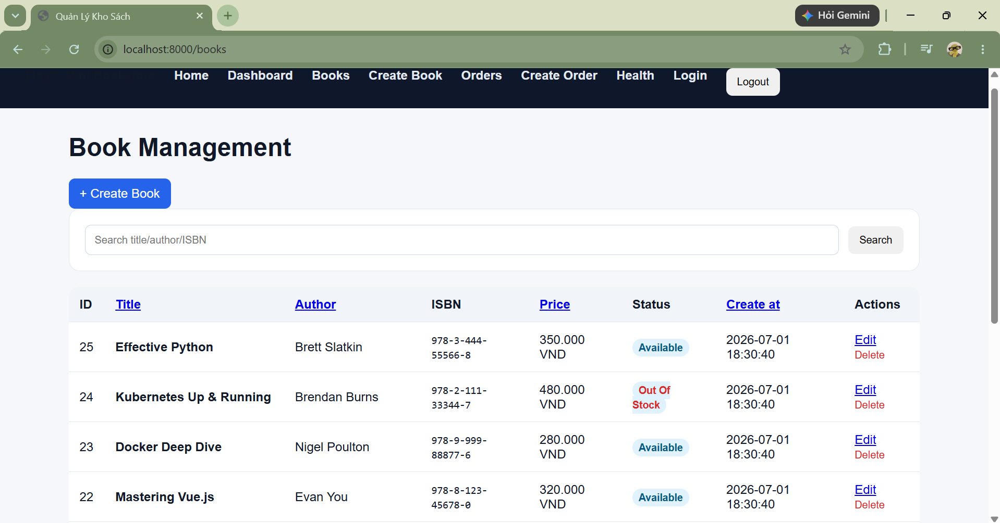
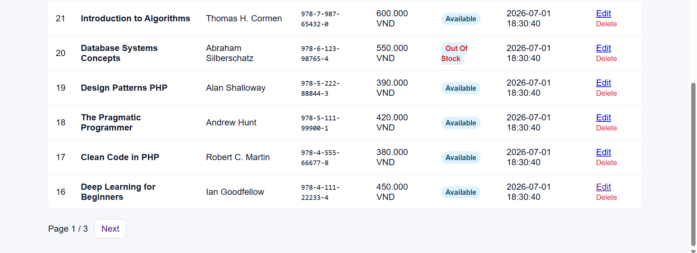

### Thêm sách mới
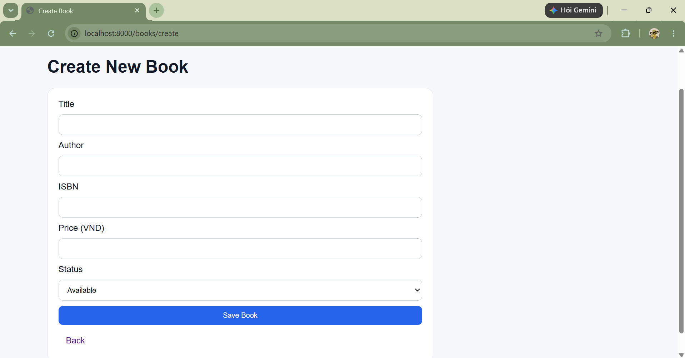

### Chỉnh sửa sách
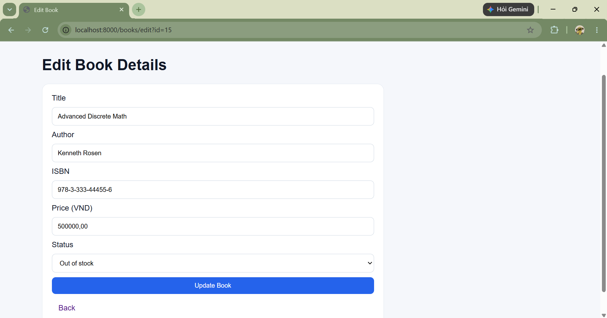

### Danh sách đơn hàng
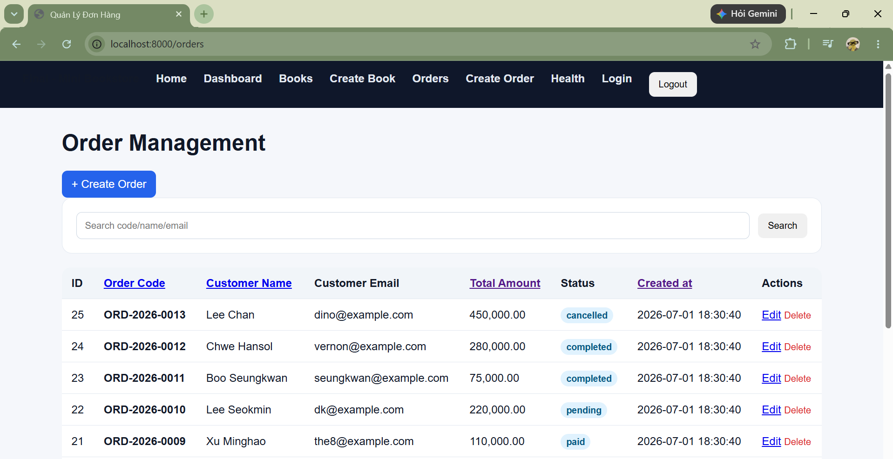
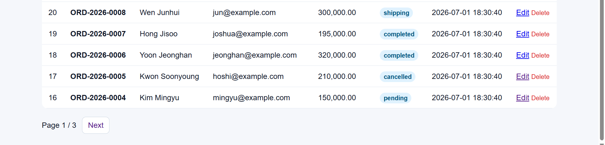

### Thêm đơn hàng mới
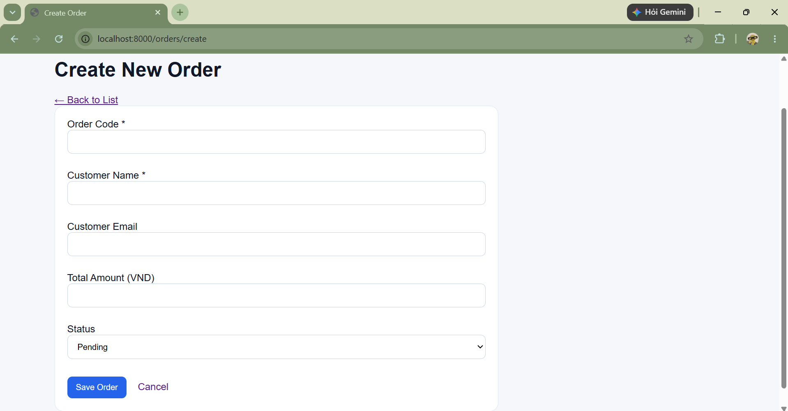

### Chỉnh sửa đơn hàng
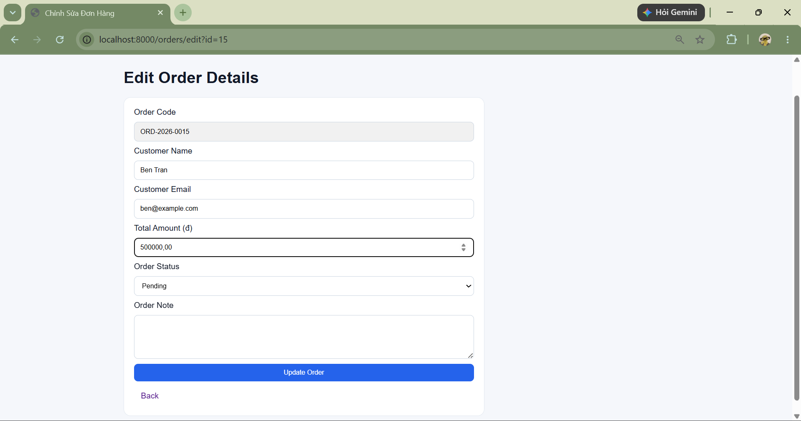